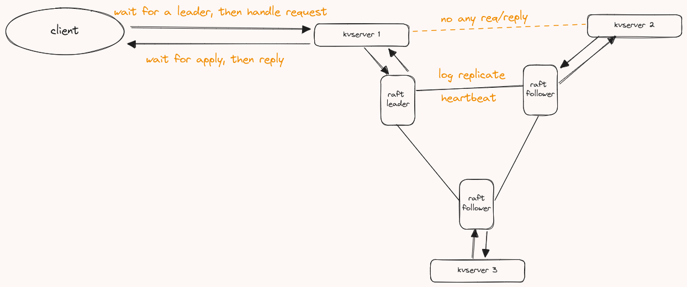

## lab3A

### 论文总结

论文里对于客户端的阐述主要集中在第八节，较为简短，提到了以下几点：

> 真正的实现在mit6.824的第八节课上给了tips，看我后续的翻译

- client如何与leader通信的

  只有leader才会处理client的请求，如果不是leader的服务器接收到了client的请求，将会把请求进行重定向到leader来处理。（在实现的时候，并没有采取这种策略，主要实现没有实现成功，就直接客户端暴力挨个请求了

- 需要额外处理leader reply超时

- 实现线性化语义

  线性化语义可以通过前面已经实现的raft底层保证，但是raft并不保证command的不重复，需要在应用层额外保证command（即client Get/Put/Append重复发送的RPC）的不重复性。引入`duplicate table`实现。

- 只读操作不记录日志（不要求实现）

### 实现思路

#### LEC 8中Lab3A提示的翻译

1. lab3A交互草图

   

2. 如果`Get`或`Put`RPC timeout了(也就是`Call() return false`)，client应该怎么处理？

   > - 如果服务端dead或者请求丢失，client re-send即可
   > - 如果服务器已经执行了请求，但是reply在网络中丢失了，re-send是有危险的

3. 不好区分上面的两种情况。上面两种情况对于client而言，看起来是一样的(no reply)。如果请求已经被执行过了，那么client仍然需要这个reply

   > 让`kvserver`
   检测重复client的请求。client每次请求都会携带一个唯一ID，并在re-send一个rpc时，携带与上次RPC相同的id。`kvserver`
   维护一个按id索引的"duplicate table"，在执行后为每个rpc创建一个条目，用以在"duplicate table"
   中记录reply。如果第二个rpc以相同的id到达，则它是重复的，可以根据"duplicate table"来生成reply。

4. 新的领导者如何获得"duplicate table"？

   > 将 id 放入传递给 Raft 的记录操作中，所有副本都应在执行时更新其table，以便如果它们成为领导者后这些信息依然保留。

5. 如果服务器崩溃，它如何恢复"duplicate table"？

   > - 如果没有快照，日志重播将填充"duplicate table"
   > - 如果有快照，快照必须包含"duplicate table"的副本

6. 如果重复请求在原始请求执行之前到达怎么办？

   再次调用`Start()`，会导致它可能在log中两次。当`cmd`出现在`applyCh`上时，如果table里已经有了，就没有必要执行了。

7. 保持table较小的idea

    - 每个client一个条目，而不是每次 RPC 一个条目

    - 每个client只有一次 RPC 没有完成

      > 每个客户端一次只能有一个未完成的RPC，这意味着客户端在发送一个RPC请求之后，必须等待服务器对该请求的响应，才能发送下一个RPC请求。这样可以确保每个客户端一次只有一个RPC请求在处理中，简化了并发控制。

    - 每个client按顺序对 RPC 进行编号

    - 当服务器收到client 第10个RPC 时，它可以忽略client的较低条目，因为这意味着client永远不会重新发送旧的 RPC

8. 一些细节

    - 每个client都需要一个唯一的client id（64位随机数字即可）
    - client需要在每次rpc中发送client id和seq，如果需要re-send，client就携带相同的seq
    - kvserver中按client id索引的table仅包含 seq 和value（如果已执行）
    - RPC 处理程序首先检查table，只有 seq 大于 table 条目的seq才能执行`Start()`
    - 每个log条目必须包含client id和seq
    - 当operation出现在 `applyCh` 上时，更新client table条目中的 seq 和 value，唤醒正在等待的 RPC 处理程序（如果有）

9. `kvserver`可能会返回table中的旧值，但是返回的确实是当前值，没有问题。

   > C1 C2
   >
   >    \-- --
   > put(x,10)
   > first send of get(x), reply(10) dropped
   > put(x,20)
   > re-sends get(x), server gets 10 from table, not 20
   >
   >   get(x) and put(x,20) run concurrently, so could run before or after;
   > so, returning the remembered value 10 is correct

#### client call实现

客户端没啥好说，不断轮询server，直到请求到leader，当然为了区分重复rpc，需要携带客户端标识和rpc重复标识

```go
func (ck *Clerk) Get(key string) string {
	defer func() {
		Debug(dGet, "C%d(Seq %d) -> S%d Get {key:%s}", ck.clientId, ck.sequenceId, ck.leader, key)
	}()
	args := &GetArgs{
		Key:        key,
		ClientId:   ck.clientId,
		SequenceId: ck.sequenceId,
	}
	ck.sequenceId++
	server := ck.leader

	for {
		reply := &GetReply{}
		if ok := ck.servers[server].Call("KVServer.Get", args, reply); ok /*网络正常*/ &&
			reply.Leader /*请求的是leader*/ {
			ck.leader = server
			return reply.Value
		} else /*网路分区或请求的不是leader，请求下一个*/ {
			server = (server + 1) % len(ck.servers)
		}
	}
}

func (ck *Clerk) PutAppend(key string, value string, op string) {
	defer func() {
		Debug(dGet, "C%d(Seq %d) -> S%d %s {key:%s}", ck.clientId, ck.sequenceId, ck.leader, op, key)
	}()
	// like Clerk.Get
	args := &PutAppendArgs{
		Key:        key,
		Value:      value,
		Op:         op,
		ClientId:   ck.clientId,
		SequenceId: ck.sequenceId,
	}
	ck.sequenceId++
	server := ck.leader

	for {
		reply := &PutAppendReply{}
		if ok := ck.servers[server].Call("KVServer.PutAppend", args, reply); ok /*网络正常一定返回 Err=OK*/ &&
			reply.Leader /*请求的是leader*/ {
			ck.leader = server
			return
		} else /*网路分区或请求的不是leader，请求下一个*/ {
			server = (server + 1) % len(ck.servers)
		}
	}
}

func (ck *Clerk) Put(key string, value string) {
	ck.PutAppend(key, value, "Put")
}

func (ck *Clerk) Append(key string, value string) {
	ck.PutAppend(key, value, "Append")
}
```

#### server rpc实现

```go
func (kv *KVServer) Get(args *GetArgs, reply *GetReply) {
	defer func() {
		Debug(dGet, "S%d(%s) Get args{%+v} reply{%+v}", kv.me, kv.rf.Role(), args, reply)
	}()

	op := Op{
		Type:       GET,
		Key:        args.Key,
		ClientId:   args.ClientId,
		SequenceId: args.SequenceId,
	}

	// 如果是leader则会追加成功；否则会失败并返回当前不是leader的错误，客户端定位下一个server
	index, term, isLeader := kv.rf.Start(op)
	if !isLeader {
		reply.Value, reply.Err, reply.Leader = "", ErrNoKey, false
		return
	}

    // leader 才有资格等待apply协程唤醒
	kv.mu.Lock()
	ch := make(chan int)
	kv.wakeClient[index] = ch
	kv.mu.Unlock()

	// 延迟释放资源
	defer func() {
		go kv.clean(index)
	}()

	select {
	case <-time.After(rpcTimeout) /*超时还没有提交*/ :
	case msgTerm := <-ch /*阻塞等待唤醒*/ :
		if msgTerm == term /*term一样表示当前leader不是过期的leader*/ {
			kv.mu.Lock()
			if val, ok := kv.data[args.Key]; ok {
				reply.Value, reply.Err, reply.Leader = val, OK, true
			} else {
				reply.Value, reply.Err, reply.Leader = "", ErrNoKey, true
			}
			kv.mu.Unlock()
			return
		}
	}

	reply.Value, reply.Err, reply.Leader = "", ErrNoKey, false
	return
}

func (kv *KVServer) PutAppend(args *PutAppendArgs, reply *PutAppendReply) {
	defer func() {
		Debug(dAppend, "S%d(%s) PutAppend args{%+v} reply{%+v}", kv.me, kv.rf.Role(), args, reply)
	}()

	op := Op{
		Type:       OpType(args.Op),
		Key:        args.Key,
		Value:      args.Value,
		ClientId:   args.ClientId,
		SequenceId: args.SequenceId,
	}

	kv.mu.Lock()
	// 如果follower或leader已经请求过了，可以直接返回了
	if ind, ok := kv.duptable[args.ClientId]; ok && ind >= args.SequenceId {
		kv.mu.Unlock()
		reply.Err, reply.Leader = OK, true
		return
	}
	kv.mu.Unlock()

	index, term, isLeader := kv.rf.Start(op)
	if !isLeader {
		reply.Err, reply.Leader = OK, false
		return
	}

	kv.mu.Lock()
	ch := make(chan int)
	kv.wakeClient[index] = ch
	kv.mu.Unlock()

	defer func() {
		go kv.clean(index)
	}()

	select {
	case <-time.After(rpcTimeout):
	case msgTerm := <-ch /*阻塞等待*/ :
		if msgTerm == term /*term一样表示当前leader不是过期的leader*/ {
			reply.Err, reply.Leader = OK, true
			return
		}
	}

	reply.Err, reply.Leader = OK, false
	return
}
```

#### 额外的apply实现

kvserver位于raft的应用层，需要将raft提交的command应用到状态机里，也就是执行command。需要注意的是，为了保证新leader也同时具备相同的log和状态机，所以不论是leader还是follower都需要从applyCh管道取出log并还原出原来的command，然后顺序command。

注意，在上面的提示翻译中，raft底层实现并没有判重机制，所以需要在执行command之前再判一次重。

等待应用完状态机过后，leader才reply客户端。

```go
// raft提交的command，应用层应用，这个是针对所有的server
// 对于leader：把所有已提交的command，执行并应用到状态机中；并且leader也需要让客户端reply
// 对于follower：也需要把已提交的command，执行并应用到状态机中；follower没有客户端请求，无需等待
// 应用状态机的时候，只需要应用Put/Append即可，Get不会对状态机造成任何影响
func (kv *KVServer) apply() {
	for msg := range kv.applyCh {

		kv.mu.Lock()
		index := msg.CommandIndex
		term := msg.CommandTerm
		op := msg.Command.(Op)

		if preSequenceId, ok := kv.duptable[op.ClientId]; ok &&
			preSequenceId == op.SequenceId /*应用前需要再判一次重*/ {
		} else /*没有重复，可以应用状态机并记录在table里*/ {
			kv.duptable[op.ClientId] = op.SequenceId
			switch op.Type {
			case PUT:
				kv.data[op.Key] = op.Value
			case APPEND:
				if _, ok := kv.data[op.Key]; ok {
					kv.data[op.Key] = kv.data[op.Key] + op.Value
				} else {
					kv.data[op.Key] = op.Value
				}
			case GET:
				/*noting*/
			}
		}

		if ch, ok := kv.wakeClient[index]; ok /*leader唤醒客户端reply*/ {
			Debug(dClient, "S%d wakeup client", kv.me)
			ch <- term
		}
		Debug(dApply, "apply msg{%+v}", msg)

		kv.mu.Unlock()
	}
}
```


### 调试过程

**labgob warning: Decoding into a non-default variable/field Err may not work**问题

这个问题的出现意思是，多个rpc调用了相同的reply。解决方案就是每次发起rpc的时候，新分配一个reply

**`Test: ops complete fast enough (3A) ...`用例**

该用例测试结果显示`Operations completed too slowly 100.000356ms/op > 33.333333ms/op`

表示每次操作花费时间过多，其实这个问题刚开始出现我就猜到是哪出现问题了。主要是我在实现底层raft的时候，应用层调用`Start`后，需要等待到下一次心跳（100ms）才能发送日志同步。所以，应用层调用`Start`过后不能立即同步日志。解决方案就是在`Start`中**立即**开启一致性协议

在`Start`中加入下面的代码，用以唤醒log replicate

```go
go func() {
    rf.replicateSignal <- struct{}{}
}()
```

raft实例启动的时候注册并监听下面的事件驱动

```go
func (rf *Raft) logReplicateEvent() {
	for rf.killed() == false {
		select {
		case <-rf.replicateSignal:
			rf.mu.Lock()
			if rf.role == leader {
				rf.heartbeatBroadcast()
				rf.electionTimer.Reset(withRandomElectionDuration())
			}
			rf.mu.Unlock()
		}
	}
}
```

**Test: partitions, one client (3A) ...**用例

发现分区过后，rpc一直卡住没有reply，导致整个raft底层和kvserver上层都卡死了9分钟。后面也参考了一些博客，应该引入超时机制避免rpc没有reply，一直卡死的情况。

```go
select {
case <-time.After(rpcTimeout):
case msgTerm := <-ch /*阻塞等待rpc reply*/ :
    // todo
}
```

### 结果

脚本测试过100次，无报错

```bash
➜  kvraft git:(main) go test -race -run 3A
Test: one client (3A) ...
  ... Passed --  15.2  5  4331  666
Test: ops complete fast enough (3A) ...
  ... Passed --  25.1  3  3997    0
Test: many clients (3A) ...
  ... Passed --  15.8  5  6663  838
Test: unreliable net, many clients (3A) ...
  ... Passed --  16.5  5  5576  751
Test: concurrent append to same key, unreliable (3A) ...
  ... Passed --   1.1  3   233   52
Test: progress in majority (3A) ...
  ... Passed --   0.4  5    58    2
Test: no progress in minority (3A) ...
  ... Passed --   1.0  5   111    3
Test: completion after heal (3A) ...
  ... Passed --   1.0  5    67    3
Test: partitions, one client (3A) ...
  ... Passed --  22.4  5  4432  541
Test: partitions, many clients (3A) ...
  ... Passed --  23.4  5  7680  762
Test: restarts, one client (3A) ...
  ... Passed --  19.6  5  6127  693
Test: restarts, many clients (3A) ...
  ... Passed --  20.3  5 11905  879
Test: unreliable net, restarts, many clients (3A) ...
  ... Passed --  21.1  5  6442  762
Test: restarts, partitions, many clients (3A) ...
  ... Passed --  27.5  5 11506  737
Test: unreliable net, restarts, partitions, many clients (3A) ...
  ... Passed --  28.4  5  6395  673
Test: unreliable net, restarts, partitions, random keys, many clients (3A) ...
  ... Passed --  30.6  7 11251  680
PASS
ok      6.5840/kvraft   270.706s
```

